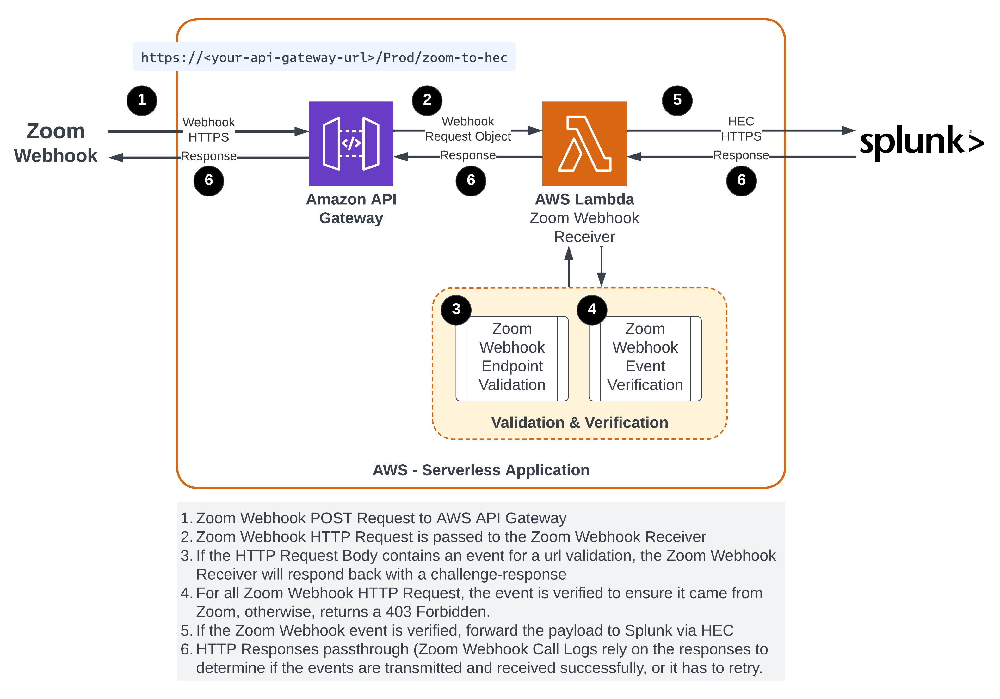

# Zoom-Webhook-to-Splunk-HTTP-Event-Collector Serverless Application for AWS <!-- omit in toc -->

This application allows receiving, validating and sending the Zoom Video Conferencing Webhook events to Splunk through HTTP Event Collector (HEC).

## Table of Contents <!-- omit in toc -->
- [Changelog](#changelog)
- [How to deploy](#how-to-deploy)
  - [Option A](#option-a)
  - [Option B](#option-b)
- [Technicality](#technicality)
- [Serverless Application Parameters](#serverless-application-parameters)
- [Example URL that you'd provide in the Zoom Webhook Application Event Subscription:](#example-url-that-youd-provide-in-the-zoom-webhook-application-event-subscription)
- [Data Flow Diagram](#data-flow-diagram)
- [Splunk Event Metadata](#splunk-event-metadata)
- [License](#license)

## Changelog

**1.1.0 (June 2023)**
- Support for [Zoom Challenge-Response Check (CRC)](https://developers.zoom.us/docs/api/rest/webhook-reference/#validate-your-webhook-endpoint)
- Zoom event verification using latest [Zoom's header method](https://developers.zoom.us/docs/api/rest/webhook-reference/#verify-webhook-events)

## How to deploy

### Option A

Use AWS Serverless Application Repository (SAM) and search for `Zoom-Webhook-to-Splunk-HTTP-Event-Collector` to deploy

### Option B

Use AWS CloudFormation using the [zoom-webhook-to-hec.yaml](./zoom-webhook-to-hec.yaml) template and deploy/create a stack in the `us-west-1` region. 

The lambda `.zip` package is available in S3 (`us-west-1`) via `s3://zoom-webhook-splunk-hec/function.zip`

## Technicality

This application will create a lambda function, with an API Gateway trigger. When deployed, you can use the API Gateway to send real-time data from the Zoom Video Conferencing Webhook into Splunk. 
- The lambda function is a receiver that validates the incoming Zoom Webhook Payload using the Secret Token before forwarding to Splunk
- The receiver also handles Zoom challenge-response check (CRC) whenever it receives one

## Serverless Application Parameters

The following parameters will be required during the setup and installation of the Serverless Application:

- Zoom Webhook [Secret Token](https://developers.zoom.us/docs/api/rest/webhook-reference/#verify-webhook-events)
- Splunk HTTP Event Collector (HEC) URL (e.g: `https://your.server.com`)
- Splunk HTTP Event Collector (HEC) Port (e.g: `443`)
- Splunk HTTP Event Collector (HEC) Token
- Splunk Index (e.g: `zoom`)

## Example URL that you'd provide in the Zoom Webhook Application Event Subscription:

`https://<your-api-gateway-url>/Prod/zoom-to-hec`

## Data Flow Diagram

1. Zoom Webhook POST Request to AWS API Gateway
2. Zoom Webhook HTTP Request is passed to the Zoom Webhook Receiver
3. If the HTTP Request Body contains an event for a url validation, the Zoom Webhook Receiver will respond back with a challenge-response
4. For all Zoom Webhook HTTP Request, the event is verified to ensure it came from Zoom, otherwise, returns a 403 Forbidden.
5. If the Zoom Webhook event is verified, forward the payload to Splunk via HEC
6. HTTP Responses passthrough (Zoom Webhook Call Logs rely on the responses to determine if the events are transmitted and received successfully, or it has to retry.

## Splunk Event Metadata
| Metadata | Value Format | Example |
| -------- | ------------ | ------- |
| time     | Zoom Webhook schema field: `event_ts` | `1686246460444` |
| host     | Source IP where the Zoom Webhook originated from | `3.235.82.172` |
| source   | `aws:api:gw:zoom:{zoom-webhook-field-event}` | `aws:api:gw:zoom:meeting.created` |
| sourcetype | `zoom:webhook` | `zoom:webhook` |

## License

Copyright 2023 Splunk Inc.

Licensed under the Apache License, Version 2.0 (the "License");
you may not use this file except in compliance with the License.
You may obtain a copy of the License at

http://www.apache.org/licenses/LICENSE-2.0

Unless required by applicable law or agreed to in writing, software
distributed under the License is distributed on an "AS IS" BASIS,
WITHOUT WARRANTIES OR CONDITIONS OF ANY KIND, either express or implied.
See the License for the specific language governing permissions and
limitations under the License.
